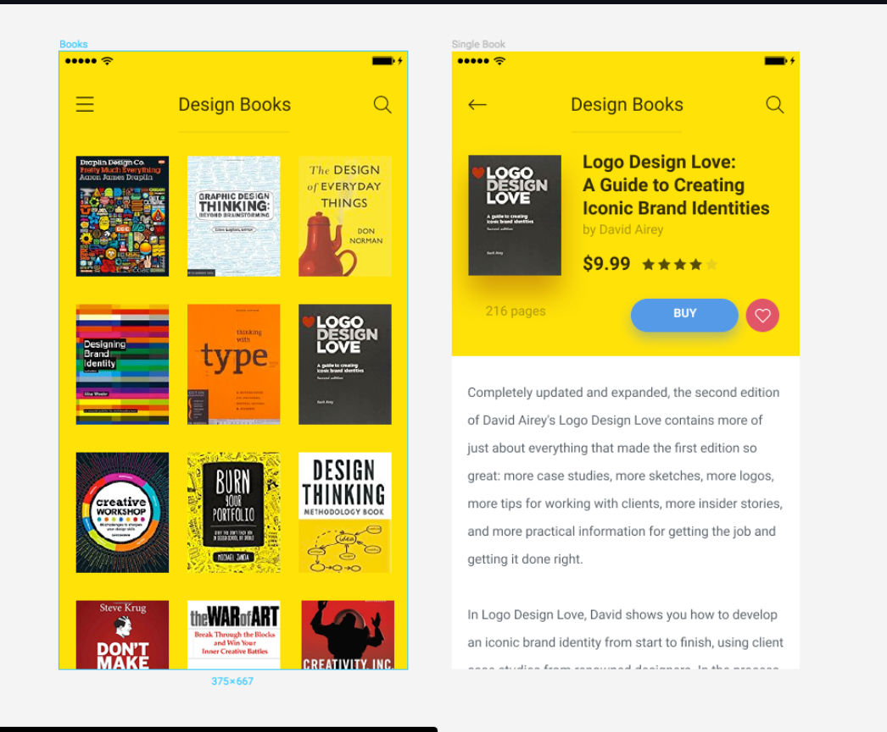

<h1>Books Google</h1>

Site for access: https://books-google-test.netlify.app/

<h3>Clone project</h3>

````
git clone https://github.com/Yuri-Tiofilo/books-google.git
````

<h3>Install Dependencies</h3>

````
yarn install
````

<h3>Start Application</h3>

````
yarn install
````

<h3>Design Of Application</h3>


